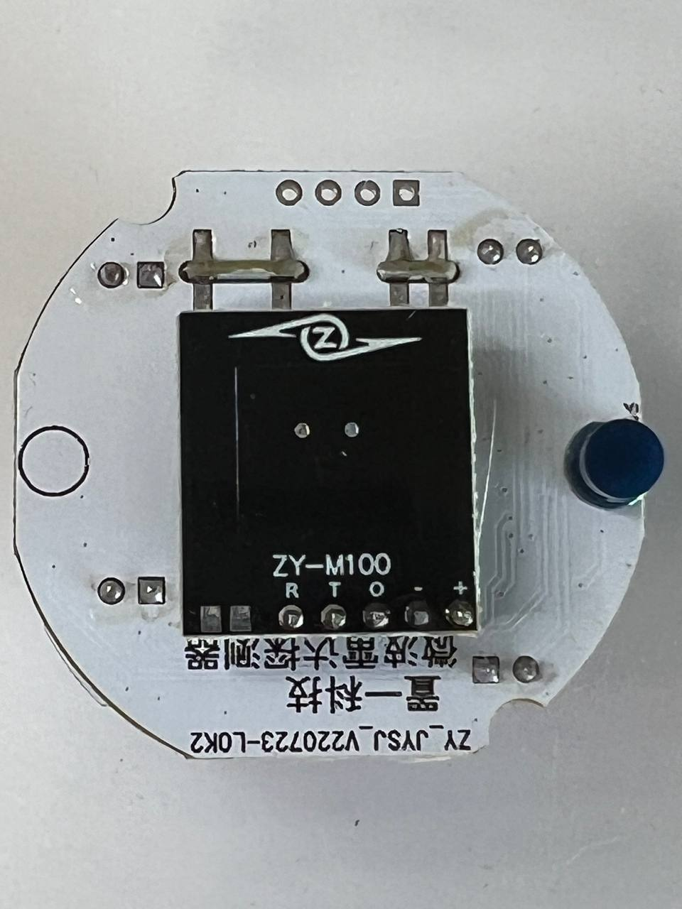

# ZY-M100-L/S_1/S_2/24G/24GV2 solving network spamming problem by disabling Target Distance reporting
Mods:
- Target distance (DP: 9/109) reporting disabled.
- Settings report interval (DPs: 1, 4, 2, 3, 6, 101, 102, 103, 104) increased to 60s, stock FW 10s.
- Illuminance Lux report interval (DP 104) increased to 10s, stock FW 500ms

Suppoted models:
- ZY-M100_L [(_TZE204_ztc6ggyl)](./ZY-M100_L_TZE204_ztc6ggyl-TargetDistance_disable.bin)
- ZY-M100-S_1 [(_TZE204_sxm7l9xa)](./ZY-M100-S_1_TZE204_sxm7l9xa-TargetDistance_disable.bin) [(_TZE204_e5m9c5hl)](./ZY-M100-S_1_TZE204_e5m9c5hl-TargetDistance_disable.bin)
- ZY-M100-S_2 [(_TZE204_qasjif9e)](./ZY-M100-S_2_TZE204_qasjif9e-TargetDistance_disable.bin)
- ZY-M100-24G [(_TZE204_ijxvkhd0)](./ZY-M100-24G_TZE204_ijxvkhd0-TargetDistance_disable.bin)
- ZY-M100-24GV2 [(_TZE204_7gclukjs)](./ZY-M100-24GV2_TZE204_7gclukjs-TargetDistance_disable.bin)
- ZY-M100-24GV3 [(_TZE204_ya4ft0w4)](./ZY-M100-24GV3_TZE204_ya4ft0w4_increased_report_interval_TD_0_disable.bin)
- ZY-M100-24GV3 [(_TZE200_gkfbdvyx)](./ZY-M100-24GV3_TZE200_gkfbdvyx_increased_report_interval_TD_0_disable.bin)

Models with secured chip (not supported):
- WZ-M100 _TZE204_laokfqwu
##




# Connect to [JLink](http://www.segger.com)

|Signal|ZY-M100-L     |J-Link  |GD32|
|:-----|-------------:|-------:|---:|
|VCC   |(square pad) 1|(Vref) 1|    |
|GND   |2             |       4|    |
|SWDIO |3             |       7|19  |
|SWCLK |4             |       9|20  |


## Backup original firmware
```batchfile
JLink.exe -device GD32E230F8 -if SWD -speed 4000 -autoconnect 1 
```
```
savebin ZY-M100_bkup.bin 0x08000000 0x10000
exit
```

## Flash modified firmware

```batchfile
JLink.exe -device GD32E230F8 -if SWD -speed 4000 -autoconnect 1 
```
```
loadfile ZY-M100-{your_model_here}-TargetDistance_disable.bin 0x08000000 reset
VerifyBin ZY-M100-{your_model_here}-TargetDistance_disable.bin  0x08000000
exit
```
## Restore backuped firmware

```batchfile
JLink.exe -device GD32E230F8 -if SWD -speed 4000 -autoconnect 1 
```
```
loadfile ZY-M100_bkup.bin 0x08000000 reset
VerifyBin ZY-M100_bkup.bin  0x08000000
exit
```
# Connect to [ST-Link V2 clone](http://www.aliexpress.com)

|Signal|ZY-M100-L     |ST-Link V2|GD32|
|:-----|-------------:|---------:|---:|
|VCC   |(square pad) 1|         2|    |
|GND   |2             |         7|    |
|SWDIO |3             |         6|19  |
|SWCLK |4             |         4|20  |

**Be careful check adapter pinout! Some clones have different one.**


## Backup original firmware using [OpenOCD](https://github.com/openocd-org/openocd/releases/tag/latest)
```batchfile
openocd -f interface/stlink.cfg -f target/gd32e23x.cfg -c init -c "reset halt" -c "flash read_bank 0 ZY-M100_bkup.bin" -c "reset" -c shutdown
```

## Flash modified firmware
```batchfile
openocd -f interface/stlink.cfg -f target/gd32e23x.cfg -c init -c "reset halt" -c "flash erase_sector 0 0 last" -c "flash write_bank 0 ZY-M100-{your_model_here}-TargetDistance_disable.bin" -c "flash verify_bank 0 ZY-M100-{your_model_here}-TargetDistance_disable.bin" -c "reset" -c shutdown
```
## Restore backuped firmware
```batchfile
openocd -f interface/stlink.cfg -f target/gd32e23x.cfg -c init -c "reset halt" -c "flash erase_sector 0 0 last" -c "flash write_bank 0 ZY-M100_bkup.bin" -c "flash verify_bank 0 ZY-M100_bkup.bin" -c "reset" -c shutdown
```

## [Step by step guide](https://github.com/Koenkk/zigbee2mqtt/issues/19045#issuecomment-2362489362) by [@tandarra](https://github.com/tandarra)

# Software
- [ST-LINK, ST-LINK/V2, ST-LINK/V2-1, STLINK-V3 USB driver signed for Windows7, Windows8, Windows10](https://www.st.com/en/development-tools/stsw-link009.html)
- [OpenOCD](https://github.com/openocd-org/openocd/releases/latest)
- 
# tech info
- Microwave motion sensor module [JYSJ_5807_A01](./5807_A01.pdf)
- TuyaMCU [GD32E230F8P6TR](./GD32E230F8P6.pdf)
- Zigbee module [ZS3L](https://developer.tuya.com/en/docs/iot/zs3l?id=K97r37j19f496)
- [Адаптеры JTAG с поддержкой SWD](https://microsin.net/programming/arm/swd-jtag-adapters.html)
- [SWJ adapters](https://wiki.cuvoodoo.info/doku.php?id=jtag)
