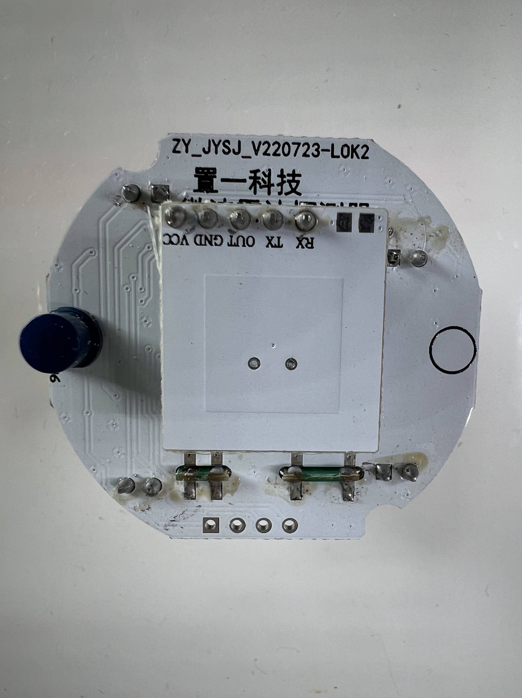
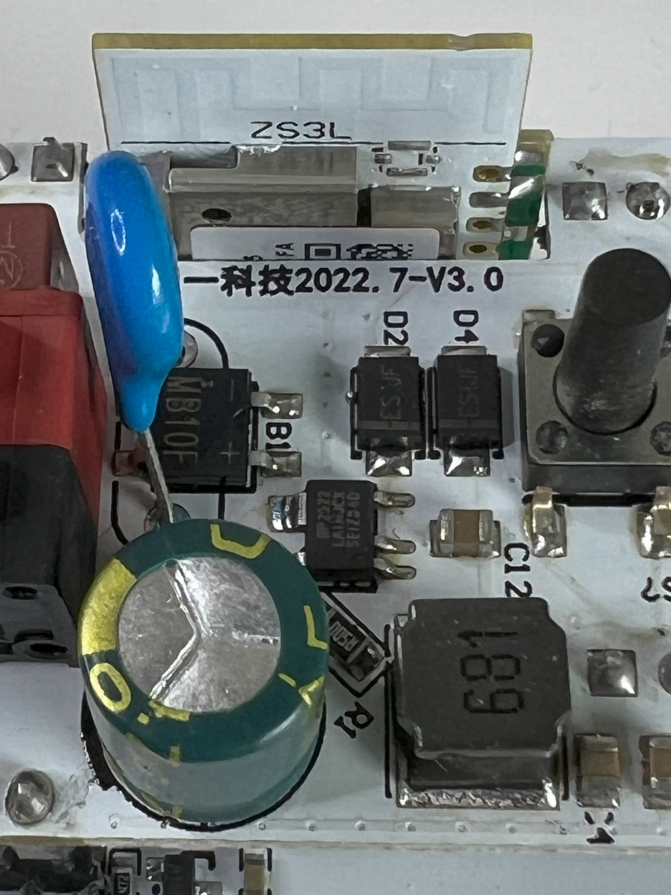
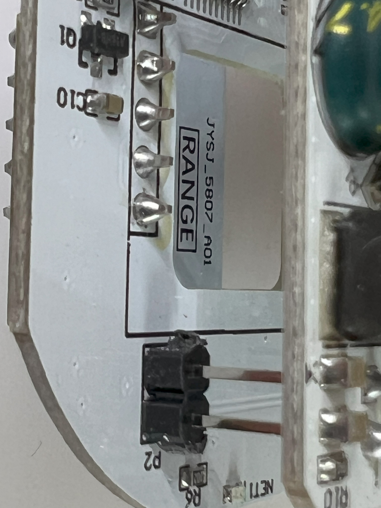
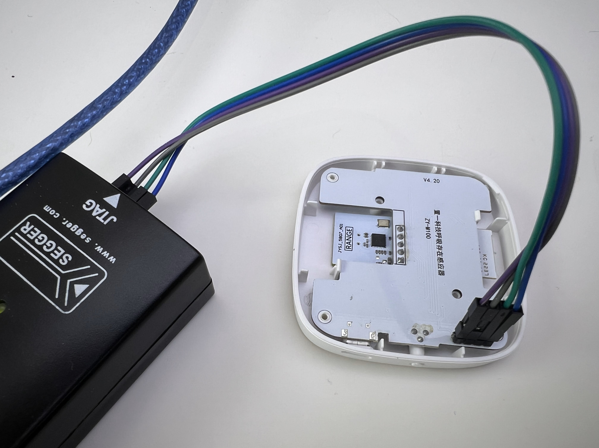
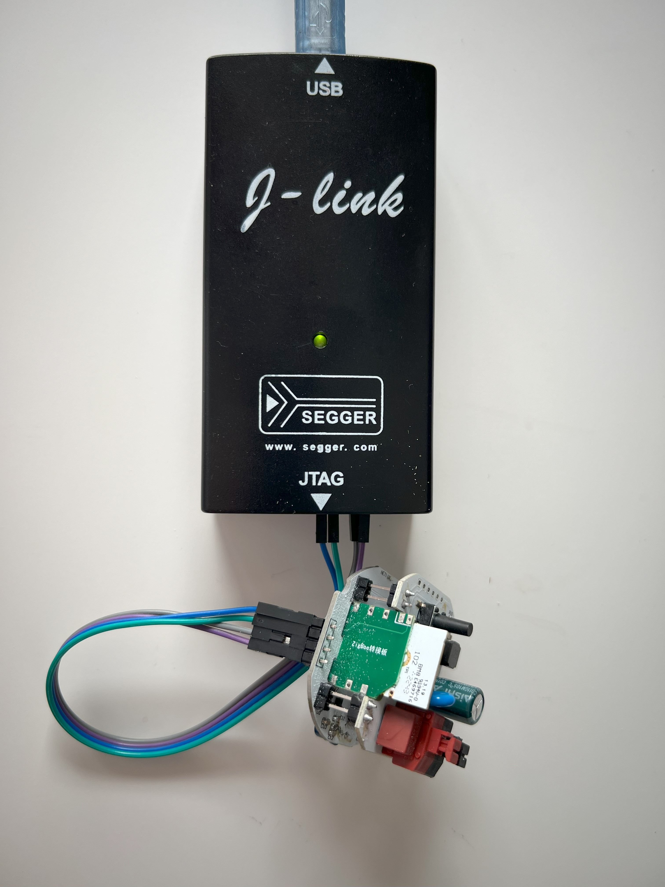
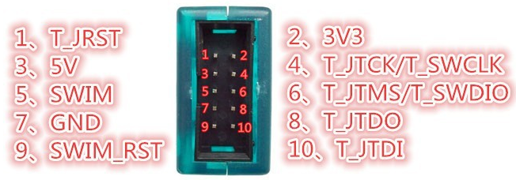

# ZY-M100-L (_TZE204_ztc6ggyl) solving network spamming problem by disabling Target Distance reporting
This solution for **5.8G sensors only** with [JYSJ_5807_A01](./5807_A01.pdf) module.






# Connect to [JLink](http://www.segger.com)

|Signal|ZY-M100-L     |J-Link  |GD32|
|:-----|-------------:|-------:|---:|
|VCC   |(square pad) 1|(Vref) 1|    |
|GND   |2             |       4|    |
|SWDIO |3             |       7|19  |
|SWCLK |4             |       9|20  |




## Backup original firmware
```batchfile
JLink.exe -device GD32E230F8 -if SWD -speed 4000 -autoconnect 1 
```
```
savebin ZY-M100_L.bin 0x08000000 0x10000
exit
```

## Flash modified firmware

```batchfile
JLink.exe -device GD32E230F8 -if SWD -speed 4000 -autoconnect 1 
```
```
loadfile ZY-M100_L-TargetDistance_disable.bin 0x08000000 reset
VerifyBin ZY-M100_L-TargetDistance_disable.bin  0x08000000
exit
```
## Restore backuped firmware

```batchfile
JLink.exe -device GD32E230F8 -if SWD -speed 4000 -autoconnect 1 
```
```
loadfile ZY-M100_L.bin 0x08000000 reset
VerifyBin ZY-M100_L.bin  0x08000000
exit
```
# Connect to [ST-Link V2 clone](http://www.aliexpress.com)

|Signal|ZY-M100-L     |ST-Link V2|GD32|
|:-----|-------------:|---------:|---:|
|VCC   |(square pad) 1|         2|    |
|GND   |2             |         7|    |
|SWDIO |3             |         6|19  |
|SWCLK |4             |         4|20  |




## Backup original firmware using [OpenOCD](https://github.com/openocd-org/openocd/releases/tag/latest)
```batchfile
openocd -f interface/stlink-v2.cfg -f target/gd32e23x.cfg -c init -c "reset halt" -c "flash read_bank 0 ZY-M100_L.bin" -c "reset" -c shutdown
```

## Flash modified firmware
```batchfile
openocd -f interface/stlink-v2.cfg -f target/gd32e23x.cfg -c init -c "reset halt" -c "flash erase_sector 0 0 last" -c "flash write_bank 0 ZY-M100_L-TargetDistance_disable.bin" -c "flash verify_bank 0 ZY-M100_L-TargetDistance_disable.bin" -c "reset" -c shutdown
```
## Restore backuped firmware
```batchfile
openocd -f interface/stlink-v2.cfg -f target/gd32e23x.cfg -c init -c "reset halt" -c "flash erase_sector 0 0 last" -c "flash write_bank 0 ZY-M100_L.bin" -c "flash verify_bank 0 ZY-M100_L.bin" -c "reset" -c shutdown
```

# tech info
- Microwave motion sensor module [JYSJ_5807_A01](./5807_A01.pdf)
- TuyaMCU [GD32E230F8P6TR](./GD32E230F8P6.pdf)
- Zigbee module [ZS3L](https://developer.tuya.com/en/docs/iot/zs3l?id=K97r37j19f496)
- [Адаптеры JTAG с поддержкой SWD](https://microsin.net/programming/arm/swd-jtag-adapters.html)

